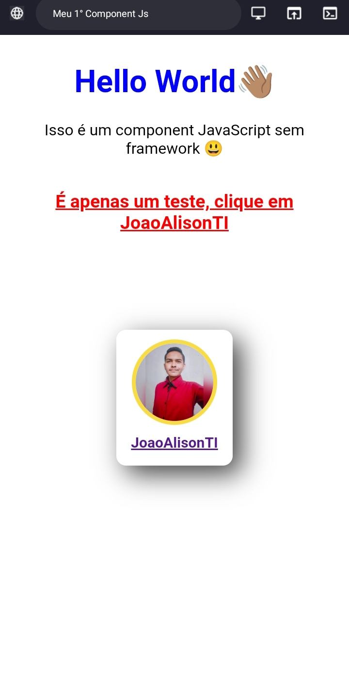

<h2 align="center"> Exemplos de Components em JavaScript 🟨</h2>

Apenas alguns exemplos de components feitos em JavaScript para treinar minhas habilidades acerca do conceito "COMPONENTES" 

### Screenshots

  

### Links
- [Acesse o projeto finalizado, online ☁️](https://joaoalisonti.github.io/CRUD-JavaScript/)

### Autor
*João Alison TI 👨🏽‍💻*

---

<strong>2023</strong>